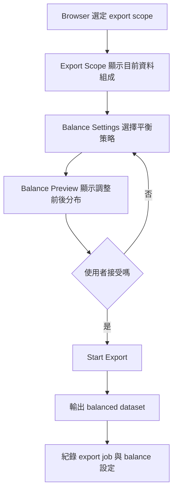

# DataViewer 0.2.0 Dataset Balance 機制設計草案

## 1. 文件目的

這份文件用來定義 `DataViewer 0.2.0` 預計實作的 `Dataset Balance` 機制，目標是在不破壞原始資料與 workspace 完整性的前提下，協助使用者處理類別資料量不平衡造成的訓練風險。

這份文件聚焦在物件偵測資料集情境，尤其是：

- 多來源資料集整合後，各類別資料量差距很大
- 小類別樣本不足，容易在訓練時被大類別壓過
- 直接把每類資料裁成一樣多，又可能刪掉有價值的大類別資料

## 2. 問題定義

### 2.1 使用者遇到的核心問題

當使用者把多個 `COCO`、`YOLO`、`RAW images + CVAT` 的資料整合進同一個 workspace 後，常會遇到這些情況：

- 某些類別數量非常多，某些類別非常少
- 某些類別雖然圖片數不低，但 bbox 數仍偏少
- 類別可能集中在特定 source 或特定場景，導致分布不均
- 如果直接用全部資料訓練，模型可能偏向學到大類別
- 如果強行做每類平均，又可能犧牲掉本來有幫助的多樣性樣本

### 2.2 這個機制不是要解決什麼

`Dataset Balance` 不打算在 `0.2.0` 解決以下問題：

- 自動保證模型訓練效果最佳
- 自動判斷哪些影像一定是高品質資料
- 取代訓練端的 class weighting / focal loss / sampler 設定
- 永久修改 workspace 中的原始樣本集
- 做完整的 active learning 或 hard example mining

## 3. 設計原則

### 3.1 保留完整資料，不在 workspace 內直接刪資料

- workspace 內保留所有已匯入資料
- balance 機制只影響 `Export` 階段的輸出集合
- 不在 import 或 browser 階段直接刪除樣本

### 3.2 不把「平衡」簡化成「所有類別一樣多」

- 類別平衡不等於直接裁成同數量
- 大類別中仍可能包含重要多樣性資料
- 真正要控制的是「過度失衡」，而不是盲目平均

### 3.3 先給觀察與預覽，再給調整

- 先讓使用者看到目前分布
- 再讓使用者選擇 balance 策略
- 最後預覽調整後輸出結果再 export

### 3.4 將 balance 視為 export 策略，而不是資料真相

- 原始 workspace 代表「資料全貌」
- balanced export 代表「某次輸出的訓練策略」
- 每次 export 可以有不同的 balance 設定

## 4. 0.2.0 產品目標

`0.2.0` 的目標不是做最完整的 dataset curation，而是先做一個：

- 看得懂目前 imbalance
- 能做保守調整
- 不會誤刪整批好資料
- 可以穩定輸出 balanced subset

### 0.2.0 成功條件

使用者可以：

1. 在 export 前看到各類別分布
2. 看到哪些類別過多、哪些類別過少
3. 選擇一種 balance 策略
4. 預覽 balance 後每類保留多少資料
5. 匯出一份 balanced dataset，而不影響 workspace 原始資料

## 5. 建議放置位置

建議將這個功能放在 `Export` 流程中，作為 `Export Settings` 與 `Export Summary` 之間的一個新區塊，或延伸現有 export 設定。

原因：

- balance 本質上是輸出策略
- 使用者最終是在匯出訓練資料時才需要做取捨
- 避免在 workspace 階段產生不可逆誤操作

## 6. 使用流程提案



## 7. 0.2.0 建議支援的 balance 指標

`0.2.0` 先支援兩種觀察維度：

### 7.1 By Image Count

- 每個類別出現在多少張圖片中
- 適合從影像層級看樣本數量

### 7.2 By Bounding Box Count

- 每個類別總共有多少 bbox
- 適合物件偵測任務更直接地看 label 量

### 7.3 預設建議

- UI 預設主顯示：`Image Count`
- 進階欄位可切換看 `BBox Count`

原因：

- 使用者通常較容易理解圖片數
- bbox 數可作為進一步分析依據

## 8. 0.2.0 建議支援的策略

### 8.1 None

不做任何平衡，保留原始 scope 中可匯出的全部資料。

用途：

- 對照組
- 使用者只想先看分布，不做裁切

### 8.2 Cap Majority Classes

對過大的類別設定保留上限，而不是直接跟最小類別拉到相同數量。

可支援參數：

- `reference = smallest | median | manual target`
- `max multiplier`

範例：

- smallest class 有 100 張
- multiplier = `3x`
- 那其他類別最多保留到 300 張

優點：

- 比完全平均更保守
- 可降低大類別壓制問題
- 不會一次砍掉太多資料

這會是 `0.2.0` 的主推薦策略。

### 8.3 Manual Target Per Class

允許使用者手動為個別類別輸入目標上限。

範例：

- helmet: 1200
- person: 1500
- safety-vest: 800
- fire-extinguisher: 300

優點：

- 使用者有高度控制權
- 適合已經知道任務需求的人

缺點：

- UI 較重
- 對初次使用者較不友善

建議：

- 可列為 `0.2.0` 後半或 `0.2.x` 擴充功能
- 若時間不夠可先不做

### 8.4 Balanced Subset by Target Count

讓使用者指定一個共同 target count，系統對高於目標的類別做降採樣。

範例：

- target = 500 images per class
- 每類最多保留 500

風險：

- 太容易被誤用成「硬平均」
- 容易刪掉過多好資料

建議：

- 不是預設推薦
- 若保留，應加上明顯 warning

## 9. 0.2.0 不建議先做的策略

以下策略先不建議在 `0.2.0` 實作：

- Auto oversampling with duplicate exports
- Hard example mining
- Diversity embedding-based sampling
- Source-aware weighted optimization
- Class-balanced split and full stratified export
- Training metric feedback loop

這些都很有價值，但複雜度高，且需要更多資料品質訊號。

## 10. 樣本保留策略

當某個類別超過上限，需要從中挑樣本保留時，不建議單純隨機砍掉。

### 10.1 0.2.0 建議保留邏輯

先做一個簡單但比 random 好的排序規則：

1. 優先保留來源分散
2. 優先保留 bbox 尺寸有差異的樣本
3. 優先保留 annotation 數量不同的圖片
4. 若仍不足，再用穩定隨機種子抽樣

### 10.2 具體做法

每張圖可計算一組 sampling key：

- source id
- 類別 bbox count
- max bbox area ratio bucket
- 檔名或 image id hash

目標不是完美最佳化，而是避免輸出結果只偏向某一個 source 或只保留相似樣本。

## 11. UI 提案

### 11.1 Export Settings 新區塊

新增 `Balance Settings` 區塊，介於 `Export Scope` 和 `Export Summary` 之間。

建議欄位：

- `Balance Strategy`
  - `None`
  - `Cap Majority Classes`
  - `Balanced Subset`
- `Balance Metric`
  - `Image Count`
  - `BBox Count`
- `Reference`
  - `Smallest Class`
  - `Median Class`
  - `Manual Target`
- `Max Ratio`
  - 例如 `2x`, `3x`, `5x`
- `Random Seed`
  - 若 balance 會做 sampling，沿用 export seed 或獨立 seed

### 11.2 Balance Preview 區塊

顯示兩欄對照：

- `Current Distribution`
- `Balanced Distribution`

每個類別至少顯示：

- 類別名稱
- 原始圖片數
- 平衡後圖片數
- 原始 bbox 數
- 平衡後 bbox 數
- 保留比例

### 11.3 Warning 文案

若使用者選到可能過度裁切的策略，要顯示 warning：

- This strategy may discard many valid training images from majority classes.
- Consider using `Cap Majority Classes` before forcing equal class counts.

## 12. 資料模型提案

### 12.1 前端設定模型

```ts
export type BalanceStrategy = "none" | "cap-majority" | "balanced-subset";
export type BalanceMetric = "image-count" | "bbox-count";
export type BalanceReference = "smallest" | "median" | "manual";

export type ExportBalanceConfig = {
  strategy: BalanceStrategy;
  metric: BalanceMetric;
  reference: BalanceReference;
  maxMultiplier?: number;
  manualTargetPerClass?: Record<string, number>;
  seed?: number;
};
```

### 12.2 Export Preview 擴充資料

```ts
export type BalancePreviewRow = {
  categoryId: string;
  categoryName: string;
  originalImageCount: number;
  balancedImageCount: number;
  originalBoxCount: number;
  balancedBoxCount: number;
  keepRatio: number;
};

export type BalancePreview = {
  rows: BalancePreviewRow[];
  removedImages: number;
  affectedCategories: number;
};
```

### 12.3 Export Job 紀錄

每次 export 建議存下 balance 設定，方便之後回看：

- strategy
- metric
- reference
- multiplier 或 manual targets
- seed

## 13. 後端處理規則提案

### 13.1 Balance 的執行時機

在 export candidate pool 建立完成後，再做 balance。

順序建議：

1. 先依 scope 選出候選圖片
2. 排除不可匯出的圖片
3. 依類別統計 image / bbox count
4. 套用 balance strategy 選出保留圖片
5. 再做 train / valid / test split
6. 匯出結果

### 13.2 為什麼要在 split 前做 balance

- 如果先 split 再 balance，會讓每個 split 的分布更難控
- 先 balance 再 split，比較容易推估最終輸出資料的大小與比例

## 14. 風險與限制

### 14.1 多類別圖片的計數問題

一張圖可能同時包含多個類別。

因此：

- 若用 `image count` 做 balance，一張圖可能同時影響多類別
- 對某一類做 downsample，可能連帶影響其他類別

這是物件偵測資料集平衡的自然限制。

`0.2.0` 建議先明確告知使用者：

- Balance is approximate at image level when one image contains multiple classes.

### 14.2 完全平衡不一定代表最好訓練效果

- 某些任務本來就是自然長尾
- 過度裁切可能降低整體泛化能力
- 因此系統應該提供 preview 與 warning，而不是強制自動平衡

### 14.3 Source bias 仍可能存在

即使類別數接近，仍可能全部來自同一個 source。

這在 `0.2.0` 只能做部分緩解，不保證完全解決。

## 15. 0.2.0 建議 MVP 範圍

如果要把這個功能控制在一個穩定可交付的版本，建議先做：

### 必做

- `Balance Settings` UI 區塊
- 類別分布統計
- `None` 策略
- `Cap Majority Classes` 策略
- `Image Count` 作為主要 balance metric
- Preview 調整前後的每類保留數量
- Export job 記錄 balance config

### 可做但非必做

- `BBox Count` 切換顯示
- `Median Class` 作為 reference
- `Balanced Subset` 模式

### 先不做

- 自動資料增強補少類
- 進階多樣性最適化
- 自動 hard example 選樣
- 訓練結果回饋式調整

## 16. 建議實作切分

### Phase 1: Analysis

- 加類別統計與 imbalance preview
- 不改 export 結果

### Phase 2: Conservative Balance

- 實作 `Cap Majority Classes`
- 預覽每類保留後數量
- 將設定寫入 export job

### Phase 3: Advanced Controls

- 手動 target
- bbox count balance
- 更多保留規則

## 17. 建議預設值

如果 `0.2.0` 要給使用者一個安全的起點，建議預設：

- `Balance Strategy = None`
- `Balance Metric = Image Count`
- `Recommended Preset = Cap Majority at 3x smallest`

也就是：

- 預設不自動動資料
- 但在 UI 上提供推薦按鈕，讓使用者一鍵套用保守平衡策略

## 18. 一句話結論

`DataViewer 0.2.0` 的 balance 機制，不應該走「把所有類別硬切成一樣多」，而應該走：

- 保留完整 workspace
- 在 export 前提供分布觀察
- 用保守的 majority cap 做第一版平衡
- 讓使用者看到預覽後再決定輸出

這樣能同時兼顧：

- 減少類別失衡帶來的訓練風險
- 避免過度刪掉有價值的好資料
- 保持 DataViewer 作為資料整理與輸出中控台的定位
