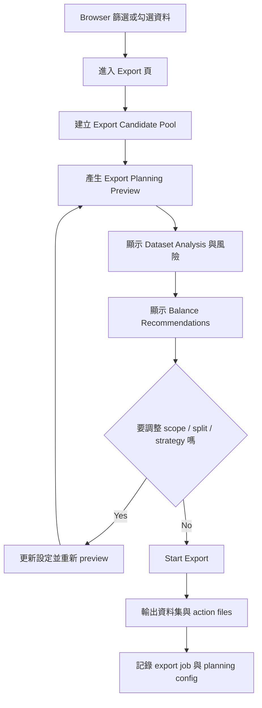

# DataViewer 0.2.0 Export-time Data Balance Analysis 實作計畫

## 1. 定位

這份文件定義 `DataViewer 0.2.0` 的 `Export-time Data Balance Analysis` 實作方向。

這個功能的核心不是分析整個 workspace 的所有資料，而是：

- 使用者先在 `Browser` / `Export Scope` 選出想匯出的資料
- 系統再只針對這一批 `export candidate pool` 做資料分析
- 根據分析結果提供保守、可解釋、可執行的平衡與修正建議

一句話版本：

> 在匯出前，幫使用者判斷「這批準備拿去訓練的資料是否健康、是否失衡、是否需要調整」。

## 2. 為什麼採用 Export-time 而不是 Workspace-wide 分析

### 2.1 比較符合目前 DataViewer 的產品流程

DataViewer 現在的主流程是：

1. 匯入資料
2. 做 Import Review
3. 在 Browser 篩選 / 勾選
4. 準備 Export
5. 匯出訓練資料集

因此，使用者真正需要平衡分析的時機，通常不是匯入後立刻看全域報表，而是：

- 我現在選的這批資料能不能拿去訓練？
- 這批資料有沒有明顯失衡或洩漏風險？
- 要不要調整 split、sampling、class weight、subset？

### 2.2 範圍更可控

相較於整個 workspace 做全域分析，export-time 分析有幾個好處：

- query 範圍較小
- UI 可以掛在現有 `ExportPage`
- 不需要先做一個大型獨立分析頁
- 更容易和現有 `Export Preview` / `Start Export` 流程共用資料

### 2.3 更容易提供可執行建議

如果分析母體就是「即將匯出的資料」，系統可以直接輸出：

- class weights suggestion
- repeat factor suggestion
- candidate downsampling list
- split repair suggestion
- collection recommendation

這些建議會比全域分析更貼近使用者下一步行動。

## 3. 對目前專案架構的影響

## 3.1 前端

目前前端已有：

- `BrowserPage`
- `ExportPage`
- `src/lib/api.ts`
- `src/types/workspace.ts`

`0.2.0` 不建議新增大型獨立分析頁，先以 `ExportPage` 為分析主場。

建議在 `ExportPage` 內新增區塊：

- `Export Scope`
- `Dataset Analysis`
- `Balance Recommendations`
- `Split and Output`
- `Export Summary`

### 3.2 Tauri Command Layer

目前已有：

- `get_export_preview`
- `start_export`

`0.2.0` 不建議讓前端自己算分析結果，避免 preview 與實際 export 結果不一致。

建議新增或整併為一個 planning command：

- `get_export_planning_preview`

它要同時回傳：

- export summary
- dataset analysis summary
- risk flags
- recommendations
- optional balance plan preview

### 3.3 Rust Core

目前大量邏輯仍集中在 `workspace_service.rs`，這次不建議繼續把分析邏輯全部塞進去。

建議至少開始切出：

- `analysis_service.rs`
- `balance_service.rs`

責任建議：

- `analysis_service.rs`：統計、規則檢查、風險旗標
- `balance_service.rs`：balance recommendation、candidate subset planning
- `workspace_service.rs`：串接 command use case，不承擔全部分析細節

### 3.4 SQLite / Repository

目前 DB 已有：

- `images`
- `annotations`
- `categories`
- `source_folders`
- `export_jobs`

這足夠支援 `0.2.0` 第一版的大部分分析，但有幾個限制：

- 沒有正式的 `camera_id`
- 沒有正式的 `batch_id`
- 沒有正式的 `timestamp`
- 沒有正式的 `location`

因此 `0.2.0` 不應承諾深度 metadata leakage 分析。

## 4. 0.2.0 功能邊界

### 4.1 要做的

`0.2.0` 聚焦在 export scope analysis：

- class-level distribution
- bbox size distribution
- source concentration
- split consistency preview
- co-occurrence dependency
- rule-based annotation anomaly summary
- duplicate risk summary（先做 exact duplicate；near duplicate 視時間）
- balance recommendation
- actionable outputs

### 4.2 先不做的

以下延後：

- 全域 workspace dashboard
- Pascal VOC loader
- metadata-based temporal leakage
- semantic diversity
- model-based hardness
- 全自動 subset optimization

## 5. 新的使用流程



## 6. 0.2.0 MVP 目標

使用者在 Export 階段應該可以回答這幾個問題：

- 這次要輸出的資料集，哪幾個 class 明顯失衡？
- 有沒有某些 class 嚴重集中在單一 source？
- train / valid / test 的分布有沒有明顯不穩？
- 有沒有明顯 duplicate / leakage / shortcut risk？
- 我應該優先補資料、調整 split、還是只做 training-time balancing？

## 7. Export Candidate Pool 定義

分析母體不是整個 workspace，而是：

- 使用者在 Browser 勾選的 `imageIds`
- 或使用者在 Export 選定的 `sourceIds`
- 或使用者在 Export 選定的 `categoryIds`
- 再經過系統排除不可匯出的圖片後的最終候選集

建議順序：

1. 依 scope 建立候選圖片集合
2. 排除壞檔 / 無法讀取圖片
3. 排除不符合輸出格式的非法標註
4. 視 export format 排除不可匯出項
5. 對剩餘圖片做 analysis

## 8. 建議新增的前端資料模型

```ts
export type ExportPlanningInput = {
  workspaceId: string;
  imageIds?: string[];
  sourceIds?: string[];
  categoryIds?: string[];
  outputFormat: "COCO" | "YOLO";
  trainRatio: number;
  validRatio: number;
  testRatio: number;
  randomSeed: number;
};

export type ExportRiskLevel = "P0" | "P1" | "P2" | "P3";

export type ExportPlanningIssue = {
  id: string;
  level: ExportRiskLevel;
  title: string;
  reason: string;
  recommendation: string;
  affectedCategoryIds?: string[];
};

export type ExportCategoryAnalysisRow = {
  categoryId: string;
  categoryName: string;
  imageCount: number;
  instanceCount: number;
  avgInstancesPerImage: number;
  independentOccurrenceRate: number;
  topSourceName?: string | null;
  topSourceShare?: number | null;
  dominantPartnerClass?: string | null;
  dominantPartnerRate?: number | null;
};

export type ExportPlanningPreview = {
  exportPreview: ExportPreview;
  issues: ExportPlanningIssue[];
  categories: ExportCategoryAnalysisRow[];
  recommendationSummary: string[];
  generatedActionFiles: string[];
};
```

## 9. 建議新增的後端模型

Rust 端可對應新增：

- `ExportPlanningInput`
- `ExportPlanningPreview`
- `ExportPlanningIssue`
- `ExportCategoryAnalysisRow`
- `ExportRecommendationSummary`

這些型別可先放在 `models.rs`，待 analysis domain 穩定後再拆到更細的 domain 模組。

## 10. 分析模組拆分建議

### 10.1 Analysis Service

輸入：

- export candidate pool
- split ratios
- output format

輸出：

- class statistics
- source statistics
- split statistics
- co-occurrence summary
- anomaly counts
- risk flags

### 10.2 Balance Service

輸入：

- analysis results
- candidate pool
- optional user strategy

輸出：

- class weight suggestion
- repeat factor suggestion
- candidate downsampling summary
- collection recommendation

### 10.3 Export Service

輸入：

- planning result
- export config

輸出：

- dataset files
- action files
- export job record

## 11. 0.2.0 實際要做的分析項目

### 11.1 Class Distribution

每個 class 顯示：

- image count
- instance count
- avg instances per image
- split-wise counts preview
- source-wise concentration
- independent occurrence rate
- top co-occurring classes

### 11.2 BBox Distribution

MVP 先做簡化版：

- normalized bbox area buckets
- aspect ratio buckets
- 每個 class 的 small / medium / large 分布

先不做太細的視覺化聚類。

### 11.3 Source Concentration

因目前沒有完整 metadata，先只看 `source_folders` 維度：

- 每個 class 是否高度集中於單一 source
- 某 source 是否過度主導特定 class

### 11.4 Split Consistency Preview

重點不是先做到完整 stratified split，而是先 preview：

- 依目前 split ratio 預估 train / valid / test 數量
- 各 class 在 split 內是否可能過少
- 是否出現某類別在 valid / test 接近沒有樣本的情況

### 11.5 Co-occurrence Dependency

每個 class 先計算：

- independent occurrence rate
- dominant partner class
- top-k co-occurrence

規則型警示示例：

- 若 `P(B|A) > 0.9` 且 `A` 的獨立出現率很低，標記 `shortcut risk`

### 11.6 Integrity / Quality Summary

這層不重做完整 import checker，而是針對 export scope 摘要：

- corrupted image count
- invalid / suspicious bbox count
- extreme aspect ratio boxes
- tiny / giant boxes

### 11.7 Duplicate / Leakage Summary

`0.2.0` 建議分階段：

- 必做：exact duplicate summary
- 選做：near duplicate summary within export scope
- 延後：cross-split near leakage with metadata-aware grouping

## 12. Risk Priority 機制

建議延續你規劃書的分級，但先用 rule-based：

- `P0`: 會直接影響 export 可信度或資料合法性的問題
- `P1`: 高機率影響訓練效果或評估可信度
- `P2`: 需要注意但不一定要立即阻擋 export
- `P3`: 提醒型資訊

建議在 UI 上呈現：

- `Top Risks`
- `Why it matters`
- `What to do next`

## 13. Recommendation 設計

`0.2.0` 的 recommendation 不要先做太多自動行動，先做三類：

### 13.1 Training-time balancing

輸出建議：

- class weights
- repeat factor
- minority class oversampling suggestion

### 13.2 Candidate downsampling

輸出候選而非直接刪除：

- majority-class low-value candidates
- exact duplicate candidates
- near-duplicate candidate groups

### 13.3 Collection recommendations

輸出補資料方向：

- 缺少的 rare class
- 缺少的 small-object coverage
- 缺少的 independent occurrence samples
- 缺少的 source coverage

## 14. UI 版位建議

### 14.1 Export Scope

保留現有：

- source / category / image selection
- output format
- split ratio
- output path

### 14.2 Dataset Analysis

新增統計卡片：

- total exportable images
- total instances
- classes count
- exact duplicates
- top source concentration
- top risk count

### 14.3 Category Analysis Table

每列顯示：

- category
- image count
- instance count
- independent occurrence rate
- top source share
- shortcut risk badge
- split risk badge

### 14.4 Recommendations Panel

每項建議顯示：

- 問題
- 為什麼有風險
- 建議採取的行動

### 14.5 Export Summary

保留現有 summary，但改由同一份 planning preview 提供資料來源。

## 15. Actionable Outputs

`0.2.0` 建議支援匯出下列 action files：

- `class_weights.yaml`
- `repeat_factor.yaml`
- `suspicious_samples.csv`
- `exact_duplicates.csv`
- `collection_recommendations.md`
- `split_repair_suggestions.md`

若時間有限，可先做到：

- `class_weights.yaml`
- `suspicious_samples.csv`
- `collection_recommendations.md`

## 16. 實作順序建議

### Phase 1. Planning API 基礎層

- 新增 `get_export_planning_preview`
- 建立 export candidate pool 專用資料結構
- 將 preview 與分析集中到後端

### Phase 2. Rule-based Analysis

- class distribution
- source concentration
- split preview
- co-occurrence
- anomaly summary
- exact duplicate summary

### Phase 3. Recommendation Layer

- issue priority
- training-time balancing suggestion
- downsampling candidate suggestion
- collection recommendation

### Phase 4. Export Integration

- export job 記錄 planning config
- 輸出 action files
- 讓 export 結果與 planning preview 一致

## 17. 測試與驗證重點

### 17.1 Rust 單元測試

- class statistics 計算正確
- co-occurrence 計算正確
- split preview 在小樣本下不失真
- exact duplicate summary 正確
- risk priority 規則正確

### 17.2 前後端整合驗證

- 同一組 export scope 每次 preview 結果一致
- UI 顯示與實際 export 用的是同一份 planning 邏輯
- split ratio 改變後 analysis / summary 會同步更新

### 17.3 手動 QA

- 空 scope
- 單一 class 資料集
- 長尾 class distribution
- 多類別共現很高的資料集
- source 極端集中資料集
- 有 exact duplicate 的資料集

## 18. 不確定但值得保留的延伸點

這些不必放進 `0.2.0`，但設計時可預留：

- near duplicate via pHash / dHash
- metadata-aware leakage analysis
- scene / lighting / angle gap gallery
- manual priority class setting
- user-confirmed balance strategy presets

## 19. 一句話結論

`DataViewer 0.2.0` 的 data balance analysis，應該定位成：

- 以 export scope 為分析母體
- 以 rule-based 診斷為核心
- 以 recommendation 與 actionable outputs 為主要價值
- 與現有 Export workflow 深度整合，而不是另起一套全域分析系統