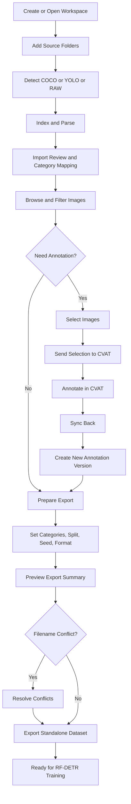
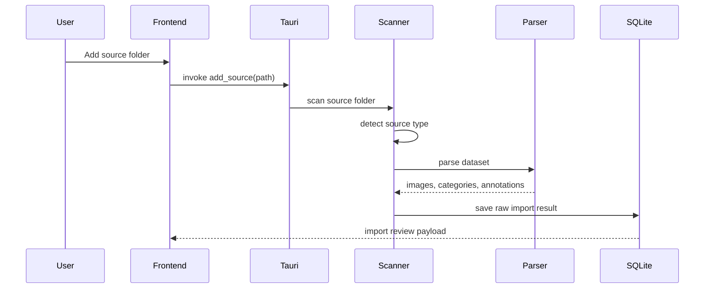
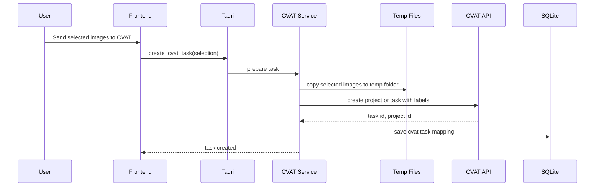
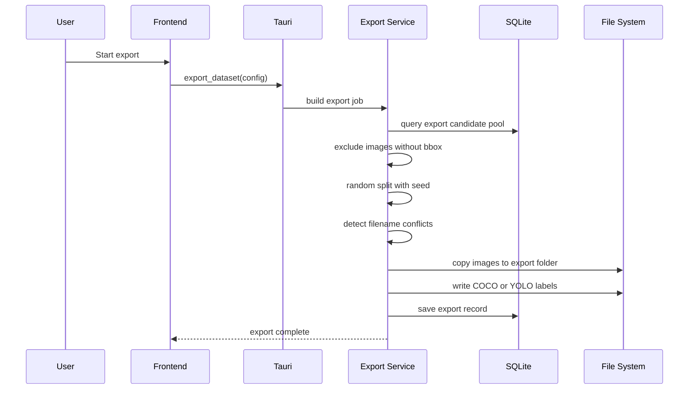

# DataViewer 功能 Workflow

## 1. Workflow 設計原則

- 所有原始來源資料都維持 read-only
- 所有長任務都應該可觀察狀態
- 每個重要轉換點都要留下 metadata 或版本紀錄
- 類別整併與檔名衝突都走人工確認

## 2. 全域主流程

## 3. Workflow 1: 建立與開啟 Workspace

### 使用者流程

1. 進入首頁
2. 選擇建立新 workspace 或開啟既有 workspace
3. 若建立新 workspace，需輸入名稱與指定 workspace 本機資料夾

### 系統流程

1. 建立 workspace metadata
2. 初始化 SQLite
3. 初始化 cache / temp / export records 目錄
4. 若是開啟既有 workspace，先執行快速健康檢查

### 成功條件

- workspace 能正常開啟
- 能在 UI 上看到健康狀態與最近使用紀錄

## 4. Workflow 2: 加入 Source Folder

### 使用者流程

1. 進入 Sources 頁
2. 點擊 `Add Source Folder`
3. 選擇本機資料夾
4. 等待來源解析
5. 若有類別，進入匯入審查

### 系統流程

### 分支情況

- 若來源型態無法辨識，顯示失敗原因
- 若是 RAW images，類別審查可以跳過，先建立 image records
- 若有部份檔案失效，允許完成匯入但要顯示 warning

## 5. Workflow 3: 類別對齊與匯入審查

### 使用者流程

1. 查看來源類別清單與數量
2. 對每個來源類別選擇：
   - 合併到既有類別
   - 建立新類別
   - 忽略不匯入
3. 確認並完成匯入

### 系統流程

1. 比對來源類別與 workspace 現有 unified categories
2. 產生候選建議
3. 等待使用者確認
4. 寫入 category mappings
5. 將 annotation 正規化資料正式落庫

### 成功條件

- workspace 層級有乾淨的 unified category 視圖
- 後續瀏覽與匯出只看 unified category

## 6. Workflow 4: 瀏覽、篩選與選取

### 使用者流程

1. 進入 Browser
2. 用來源資料夾、類別、是否已標註、檔名搜尋來篩選
3. 逐張勾選或使用 `Select All Current Filtered Results`
4. 視需要送到 CVAT 或進入匯出流程

### 系統流程

1. 從 SQLite 查詢符合條件的 image records
2. 讀取必要的縮圖或原圖 metadata
3. 回傳當前結果集
4. 將選取狀態保留在前端 session state

### UI 規則

- 綠框代表已標註
- 琥珀框代表未標註
- 縮圖不畫 bbox
- 單張檢視才顯示 bbox

## 7. Workflow 5: 送到 CVAT

### 使用者流程

1. 在 Browser 中完成篩選與勾選
2. 點擊 `Send to CVAT`
3. 確認本次選中的圖片數量與將使用的 labels
4. 建立 CVAT 任務
5. 點擊 `Open CVAT`

### 系統流程

### 注意事項

- 只送選中的圖片
- `Select All` 只代表目前篩選結果
- temp folder 由 workspace 持有，不可污染原始來源

## 8. Workflow 6: 從 CVAT 同步回來

### 使用者流程

1. 在 CVAT 完成 bbox 標註
2. 回到 DataViewer 的 CVAT Tasks 頁
3. 點擊 `Sync Back`

### 系統流程

1. 依 task id 向 CVAT API 取回標註結果
2. 轉成平台統一 annotation model
3. 建立新的 annotation version
4. 更新圖片標註狀態與類別統計

### 輸出

- 新的 annotation version
- 更新後的圖片標註狀態
- 可立即用於瀏覽與匯出

## 9. Workflow 7: 手動重新掃描

### 觸發時機

- 健康檢查發現來源異常
- 使用者知道來源資料夾新增了檔案
- 使用者懷疑索引過期

### 系統流程

1. 重新遍歷指定 source folder
2. 更新 image metadata 與檔案存在狀態
3. 對 COCO / YOLO 重新讀取來源標註
4. 保留 workspace 既有 mapping 與版本資料
5. 更新索引結果與 warning

### 第一版原則

- 不在 workspace 開啟時自動重掃
- 只在使用者明確操作時進行

## 10. Workflow 8: 匯出資料集

### 使用者流程

1. 進入 Export 頁
2. 選擇輸出格式 `COCO` 或 `YOLO`
3. 勾選要保留的類別
4. 輸入 split ratio 與 random seed
5. 指定輸出資料夾
6. 查看摘要預覽
7. 若有檔名衝突，逐項處理
8. 開始匯出

### 系統流程

### 匯出摘要至少包含

- 最終類別
- 各類別圖片數
- 各類別 bbox 數
- train / valid / test 數量
- 因無 bbox 被排除的圖片數
- 檔名衝突數

## 11. Workflow 9: 檔名衝突處理

### 觸發時機

- 多個來源在同一輸出資料夾中會撞名

### 使用者選項

- 自動加唯一後綴
- 手動改名
- 略過該圖片

### 系統要求

- 顯示來源資料夾
- 顯示原始完整路徑
- 支援 `apply to similar conflicts`

## 12. 錯誤與回復流程

### 來源資料夾不存在

- 顯示 health warning
- 阻止直接使用遺失檔案
- 提示使用者手動 rescan

### CVAT 連線失敗

- 在 CVAT Tasks 頁顯示錯誤狀態
- 保留已建立的 temp task metadata
- 允許稍後重試

### 匯出中途失敗

- 保留 export job 紀錄為 failed
- 顯示失敗原因
- 允許重新執行同設定的 export

## 13. 第一版流程完成定義

以下整條路徑能走通，就代表 MVP 已成形：

1. 建立 workspace
2. 匯入多個 COCO / YOLO / RAW 來源
3. 完成類別對齊
4. 在縮圖牆中篩選並勾選未標註圖片
5. 送到 CVAT
6. 同步回來形成新版本
7. 匯出完整獨立的 COCO 或 YOLO 資料集
