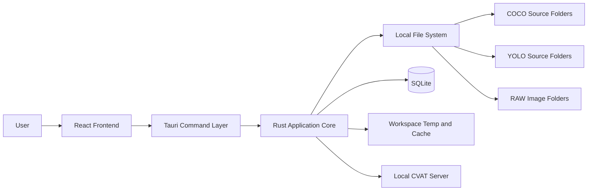
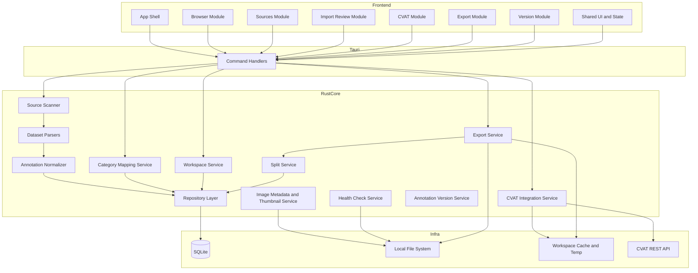
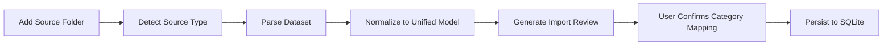
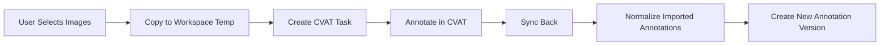
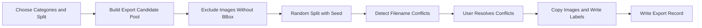

# DataViewer 模組架構圖

## 1. 架構目標

第一版架構要同時滿足這幾件事：

- 本機桌面工具，不依賴遠端後端
- 原始資料夾維持 read-only
- 支援多資料夾、多格式匯入
- 能夠與本機 CVAT 整合
- 保留後續擴充到更多格式或更多標記工具的空間

## 2. 高層系統架構



## 3. 分層責任

### 3.1 Frontend Layer

責任：

- 顯示畫面
- 管理互動狀態
- 發送 Tauri command
- 呈現掃描、同步、匯出進度

子模組：

- App Shell
- Routing
- Workspace Views
- Browser Views
- Import Review Views
- CVAT Views
- Export Views
- Shared UI System

### 3.2 Tauri Command Layer

責任：

- 作為前端與 Rust core 的安全邊界
- 接收參數並做基本驗證
- 回傳結構化資料給前端

設計方向：

- 每個 command 對應一個清楚的 use case
- 不讓前端直接碰 SQLite 或任意 filesystem 操作

### 3.3 Rust Application Core

責任：

- workspace domain logic
- 檔案掃描與格式解析
- annotation normalization
- category mapping 持久化
- CVAT 任務管理
- split 與 export
- 健康檢查與重掃描

## 4. 核心模組拆分



## 5. 模組責任說明

### 5.1 Workspace Service

負責：

- 建立 workspace
- 開啟 workspace
- 管理 workspace metadata
- 管理 source folder 掛載關係

### 5.2 Source Scanner

負責：

- 遍歷來源資料夾
- 辨識來源型態
- 建立 image record 初始索引
- 執行手動 rescan

### 5.3 Dataset Parsers

負責：

- 解析 COCO detection
- 解析 YOLO detection
- 解析 RAW image folder

輸出：

- 來源圖片清單
- 來源類別清單
- 來源 annotation 原始資料

### 5.4 Annotation Normalizer

負責：

- 將 COCO / YOLO 轉成統一 bbox domain model
- 正規化 category id 與 image reference
- 讓後續瀏覽、篩選、匯出都只面對單一內部格式

### 5.5 Category Mapping Service

負責：

- 保存來源類別到 unified category 的 mapping
- 在新來源匯入時提供審查資料
- 提供後續 export 時的最終 category 視圖

### 5.6 Image Metadata and Thumbnail Service

負責：

- 讀取尺寸等 metadata
- 提供單張預覽需要的資料
- 必要時建立縮圖快取

備註：

- 第一版瀏覽直接讀原圖
- 縮圖快取可先做成可選優化，而不是初版硬需求

### 5.7 Health Check Service

負責：

- 開啟 workspace 時快速檢查來源狀態
- 檢查來源資料夾是否存在
- 檢查已索引圖片是否失效
- 產出 warning 給 UI

### 5.8 CVAT Integration Service

負責：

- 用目前選取結果建立 CVAT task
- 將選取圖片複製到 workspace temp
- 建立 project/task label 對應
- 同步標註結果回來

### 5.9 Annotation Version Service

負責：

- 每次 sync back 時建立新版本
- 保留版本來源與時間
- 支援 UI 查詢版本歷史

### 5.10 Split Service

負責：

- 將可匯出圖片重新切成 train/valid/test
- 使用固定 random seed 生成可重現結果

### 5.11 Export Service

負責：

- 依 unified categories 過濾資料
- 排除無 bbox 圖片
- 建立輸出資料夾
- 生成 COCO 或 YOLO labels
- 複製圖片
- 處理檔名衝突決策

### 5.12 Repository Layer

負責：

- 隔離 SQLite schema 與 domain service
- 提供 query / insert / update API
- 讓未來資料表調整時不影響上層 use case

## 6. Frontend 模組建議結構

```text
src/
|- app/
|  |- router/
|  |- providers/
|  |- layout/
|- features/
|  |- workspace/
|  |- sources/
|  |- import-review/
|  |- browser/
|  |- image-detail/
|  |- cvat/
|  |- versions/
|  |- export/
|- components/
|  |- ui/
|  |- domain/
|- hooks/
|- lib/
|- styles/
```

## 7. Rust 模組建議結構

```text
src-tauri/src/
|- commands/
|- app/
|- domain/
|  |- workspace/
|  |- source/
|  |- image/
|  |- annotation/
|  |- category/
|  |- export/
|  |- cvat/
|- services/
|  |- scanner/
|  |- parsers/
|  |- health/
|  |- split/
|  |- export/
|  |- versions/
|- repository/
|- db/
|- filesystem/
|- integrations/
|  |- cvat/
```

## 8. 主要資料流

### 8.1 匯入資料流



### 8.2 CVAT 資料流



### 8.3 匯出資料流



## 9. 邊界與限制

第一版刻意不納入：

- duplicate detection service
- in-app annotation editor
- background file watcher
- multi-user sync
- cloud object storage

## 10. 這份架構的優點

- 跟你目前單人桌面工具的需求相符
- 邏輯重點放在 Rust core，前端保持薄而清楚
- dataset parser、normalizer、exporter 都是獨立模組，後續擴充格式時成本較低
- CVAT 被隔離成 integration service，之後若想接 Label Studio 也比較好換
