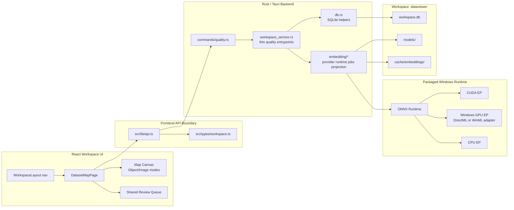
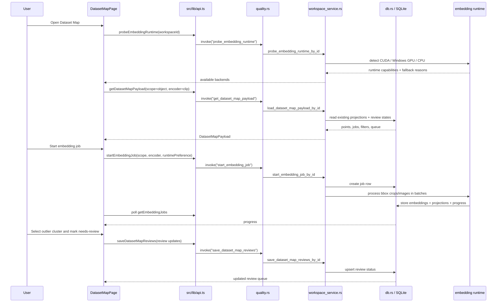

# Hybrid Dataset Map Implementation Plan

> **For agentic workers:** REQUIRED SUB-SKILL: Use superpowers:subagent-driven-development (recommended) or superpowers:executing-plans to implement this plan task-by-task. Steps use checkbox (`- [ ]`) syntax for tracking.

**Goal:** Build a packaged Windows-first Dataset Map feature that visualizes existing annotation bbox crops and images in CLIP/DINO embedding space for pre-training dataset cleaning.

**Architecture:** Add a new `Dataset Map` workspace page with Object Map as the primary mode and Image Map as the secondary mode. Backend data is stored in SQLite through new embedding/job/review tables, exposed through thin Tauri commands, and generated by an ONNX Runtime based embedding subsystem that can auto-select CUDA, Windows GPU, or CPU. The first shippable vertical slice uses mock/static projection data before enabling real ONNX inference.

**Tech Stack:** Tauri 2, React 18, TypeScript, React Query, Zustand, Rust, rusqlite, ONNX Runtime, Windows CUDA/DirectML-or-WinML GPU path, CPU fallback.

---

## Scope

### In Scope

- Add one `Dataset Map` workspace route.
- Plan both map modes in the first version:
  - `Object Map`: default mode, one point per existing annotation bbox crop.
  - `Image Map`: secondary mode, one point per image.
- Support encoder selection for both modes:
  - CLIP family.
  - DINO/DINOv2 family.
- Support runtime selection:
  - `auto`.
  - `cuda`.
  - `windows-gpu`.
  - `cpu`.
- Store embedding vectors, 2D projections, job metadata, hardware probe results, and review status in workspace SQLite.
- Link map selections to a shared review queue.
- Keep source folders read-only. Review actions mark app-owned metadata only.
- Design for packaged Windows desktop distribution. Python is allowed only for model conversion tooling, not for user runtime.

### Out Of Scope For First Implementation

- Automatic object proposal generation for raw images.
- Training-time diagnostics.
- Detector backbone/RF-DETR feature extraction.
- Permanent deletion of source data.
- Full UMAP implementation from scratch in Rust. Use a planned projection adapter or cached projection output.

---

## Modification Summary

### Frontend

- Modify `src/app/router.tsx`
  - Add `/workspace/:workspaceId/dataset-map`.
- Modify `src/app/layout/WorkspaceLayout.tsx`
  - Add `Dataset Map` navigation item.
- Modify `src/types/workspace.ts`
  - Add dataset map, embedding job, runtime, projection, point, and review types.
- Modify `src/lib/api.ts`
  - Add Tauri wrappers with mock fallback:
    - `getDatasetMapPayload`
    - `startEmbeddingJob`
    - `getEmbeddingJobs`
    - `saveDatasetMapReviews`
    - `probeEmbeddingRuntime`
- Modify `src/lib/mock-data.ts`
  - Add realistic object/image point clouds.
- Create `src/features/workspace/pages/DatasetMapPage.tsx`
  - Page shell, mode tabs, encoder/runtime controls, map canvas, side panel, review queue.
- Create `src/features/workspace/datasetMapTypes.ts`
  - UI-only derived types and helpers if needed.
- Create `src/features/workspace/datasetMapFilters.ts`
  - Shared filtering for Object Map and Image Map.
- Modify `src/styles/index.css`
  - Add dense tool-style layout, map canvas, point legend, linked review queue.

### Backend

- Modify `src-tauri/src/models.rs`
  - Add serializable/specta-compatible dataset map models.
- Modify `src-tauri/src/db.rs`
  - Add embedding schema tables and read/write helpers.
- Create `src-tauri/src/commands/quality.rs`
  - Thin Tauri command handlers for dataset map APIs.
- Modify `src-tauri/src/commands/mod.rs`
  - Re-export quality commands.
- Modify `src-tauri/src/lib.rs`
  - Register quality commands in `generate_handler!`.
- Create `src-tauri/src/embedding/mod.rs`
  - Module boundary for runtime, provider, job, and projection logic.
- Create `src-tauri/src/embedding/runtime.rs`
  - Hardware probe and execution backend selection.
- Create `src-tauri/src/embedding/providers.rs`
  - Provider/model registry for CLIP and DINO families.
- Create `src-tauri/src/embedding/jobs.rs`
  - Batch job orchestration, progress state, cancellation hooks.
- Create `src-tauri/src/embedding/projection.rs`
  - Projection storage interface and initial deterministic bootstrap projection.
- Modify `src-tauri/src/workspace_service.rs`
  - Add narrow service entrypoints that delegate to `embedding` and `db`; avoid embedding inference logic inside this large file.
- Modify `src-tauri/Cargo.toml`
  - Add runtime dependencies only when the ONNX task begins.

### Project Hygiene

- Modify `.gitignore`
  - Add `.superpowers/` because visual brainstorming artifacts are local working files.

---

## Updated Architecture



---

## Dataflow



---

## UI Mockup

```text
┌──────────────────────────────────────────────────────────────────────────────┐
│ DataViewer / Workspace                                                      │
│ Browser | Sources | Import Review | CVAT | Versions | Export | Dataset Map  │
├──────────────────────────────────────────────────────────────────────────────┤
│ Dataset Map                                                                  │
│ Pre-training quality review for existing bbox crops and image distribution. │
├──────────────────────────────────────────────────────────────────────────────┤
│ [Object Map] [Image Map]       Encoder: [CLIP ▾] [DINOv2 ▾] Runtime: [Auto] │
│ Job: Ready  Backend: CUDA fallback available CPU  [Run / Refresh Embeddings]│
├───────────────┬──────────────────────────────────────────────┬───────────────┤
│ Filters       │ Map Canvas                                   │ Selection     │
│               │                                              │               │
│ Source        │       • • •       ○ selected cluster          │ 42 crops      │
│ Category      │   • • • • •                                  │ screw         │
│ Review state  │        • • •       x outlier                 │ source A/B    │
│ Box area      │                                              │               │
│ Search        │  Legend: category color, review shape        │ [Keep] [Fix]  │
│               │                                              │ [Exclude]     │
├───────────────┴──────────────────────────────────────────────┴───────────────┤
│ Review Queue                                                                 │
│ needs-review: crop-123 screw, crop-184 screw, img-44 frame_0044.jpg          │
└──────────────────────────────────────────────────────────────────────────────┘
```

---

## SQLite Data Model

Add these tables to `INIT_SQL` in `src-tauri/src/db.rs`.

```sql
CREATE TABLE IF NOT EXISTS embedding_models (
    id TEXT PRIMARY KEY,
    family TEXT NOT NULL,
    model_id TEXT NOT NULL,
    display_name TEXT NOT NULL,
    embedding_dim INTEGER NOT NULL,
    input_size INTEGER NOT NULL,
    preprocess_version TEXT NOT NULL,
    created_at TEXT NOT NULL
);

CREATE TABLE IF NOT EXISTS embedding_jobs (
    id TEXT PRIMARY KEY,
    workspace_id TEXT NOT NULL,
    scope TEXT NOT NULL,
    model_id TEXT NOT NULL,
    runtime_preference TEXT NOT NULL,
    runtime_backend TEXT,
    status TEXT NOT NULL,
    processed_items INTEGER NOT NULL DEFAULT 0,
    total_items INTEGER NOT NULL DEFAULT 0,
    message TEXT,
    created_at TEXT NOT NULL,
    updated_at TEXT NOT NULL,
    FOREIGN KEY(workspace_id) REFERENCES workspace_meta(id)
);

CREATE TABLE IF NOT EXISTS embeddings (
    id TEXT PRIMARY KEY,
    workspace_id TEXT NOT NULL,
    scope TEXT NOT NULL,
    target_id TEXT NOT NULL,
    image_id TEXT NOT NULL,
    annotation_id TEXT,
    model_id TEXT NOT NULL,
    runtime_backend TEXT NOT NULL,
    vector BLOB NOT NULL,
    vector_norm REAL,
    created_at TEXT NOT NULL,
    UNIQUE(workspace_id, scope, target_id, model_id),
    FOREIGN KEY(workspace_id) REFERENCES workspace_meta(id),
    FOREIGN KEY(image_id) REFERENCES images(id),
    FOREIGN KEY(annotation_id) REFERENCES annotations(id)
);

CREATE TABLE IF NOT EXISTS embedding_projections (
    id TEXT PRIMARY KEY,
    workspace_id TEXT NOT NULL,
    scope TEXT NOT NULL,
    target_id TEXT NOT NULL,
    model_id TEXT NOT NULL,
    projection_method TEXT NOT NULL,
    x REAL NOT NULL,
    y REAL NOT NULL,
    created_at TEXT NOT NULL,
    UNIQUE(workspace_id, scope, target_id, model_id, projection_method),
    FOREIGN KEY(workspace_id) REFERENCES workspace_meta(id)
);

CREATE TABLE IF NOT EXISTS dataset_review_marks (
    id TEXT PRIMARY KEY,
    workspace_id TEXT NOT NULL,
    scope TEXT NOT NULL,
    target_id TEXT NOT NULL,
    status TEXT NOT NULL,
    reason TEXT,
    note TEXT,
    created_at TEXT NOT NULL,
    updated_at TEXT NOT NULL,
    UNIQUE(workspace_id, scope, target_id),
    FOREIGN KEY(workspace_id) REFERENCES workspace_meta(id)
);

CREATE INDEX IF NOT EXISTS idx_embeddings_workspace_scope_model
ON embeddings(workspace_id, scope, model_id);

CREATE INDEX IF NOT EXISTS idx_embedding_projections_workspace_scope_model
ON embedding_projections(workspace_id, scope, model_id);

CREATE INDEX IF NOT EXISTS idx_dataset_review_marks_workspace_scope
ON dataset_review_marks(workspace_id, scope);
```

---

## Public Types

Add to `src/types/workspace.ts` and mirror in `src-tauri/src/models.rs`.

```ts
export type DatasetMapScope = "object" | "image";
export type EmbeddingFamily = "clip" | "dinov2";
export type EmbeddingRuntimePreference = "auto" | "cuda" | "windows-gpu" | "cpu";
export type EmbeddingRuntimeBackend = "cuda" | "windows-gpu" | "cpu";
export type EmbeddingJobStatus = "queued" | "running" | "completed" | "failed" | "cancelled";
export type DatasetReviewStatus = "unreviewed" | "needs-review" | "keep" | "fix" | "exclude";

export type EmbeddingModelOption = {
  id: string;
  family: EmbeddingFamily;
  displayName: string;
  embeddingDim: number;
  inputSize: number;
  available: boolean;
  downloadRequired: boolean;
};

export type EmbeddingRuntimeCapability = {
  backend: EmbeddingRuntimeBackend;
  available: boolean;
  label: string;
  detail: string;
};

export type EmbeddingRuntimeProbe = {
  preference: EmbeddingRuntimePreference;
  selectedBackend: EmbeddingRuntimeBackend;
  capabilities: EmbeddingRuntimeCapability[];
  fallbackReason?: string | null;
};

export type DatasetMapPoint = {
  id: string;
  scope: DatasetMapScope;
  imageId: string;
  annotationId?: string | null;
  filename: string;
  sourceId: string;
  sourceName: string;
  categoryId?: string | null;
  categoryName?: string | null;
  bbox?: {
    x: number;
    y: number;
    width: number;
    height: number;
    areaRatio?: number | null;
  } | null;
  x: number;
  y: number;
  reviewStatus: DatasetReviewStatus;
};

export type EmbeddingJob = {
  id: string;
  scope: DatasetMapScope;
  modelId: string;
  runtimePreference: EmbeddingRuntimePreference;
  runtimeBackend?: EmbeddingRuntimeBackend | null;
  status: EmbeddingJobStatus;
  processedItems: number;
  totalItems: number;
  message?: string | null;
  updatedAt: string;
};

export type DatasetMapPayload = {
  workspaceId: string;
  scope: DatasetMapScope;
  modelId: string;
  models: EmbeddingModelOption[];
  runtime: EmbeddingRuntimeProbe;
  points: DatasetMapPoint[];
  jobs: EmbeddingJob[];
};
```

---

## Minimal Implementation Path

The smallest useful path avoids ONNX first and proves the data contract/UI:

1. Add types and mock data for object/image maps.
2. Add `/dataset-map` route and page.
3. Render mock Object Map and Image Map with encoder/runtime controls.
4. Add backend schema and read APIs returning empty points when no embeddings exist.
5. Add deterministic bootstrap projection generation from existing annotations/images.
6. Persist review marks and show review queue.
7. Add embedding job state with fake completion for command flow tests.
8. Add ONNX Runtime hardware probe.
9. Add real CLIP provider.
10. Add real DINOv2 provider.
11. Add packaged model cache and runtime fallback UX.

This path gives a testable page by step 3 and a backend-backed page by step 6, before ML runtime complexity enters.

---

## Tasks

### Task 1: Add Dataset Map Types And Mock Payload

**Files:**
- Modify: `src/types/workspace.ts`
- Modify: `src/lib/mock-data.ts`

- [ ] **Step 1: Add TypeScript types**

Append the public types from the "Public Types" section to `src/types/workspace.ts`.

- [ ] **Step 2: Add mock model/runtime/point data**

Add `sampleDatasetMapPayload` to `src/lib/mock-data.ts` with at least:

```ts
export const sampleDatasetMapPayload: DatasetMapPayload = {
  workspaceId: "factory-defect-v1",
  scope: "object",
  modelId: "clip-vit-b32",
  models: [
    {
      id: "clip-vit-b32",
      family: "clip",
      displayName: "CLIP ViT-B/32",
      embeddingDim: 512,
      inputSize: 224,
      available: true,
      downloadRequired: false,
    },
    {
      id: "dinov2-small",
      family: "dinov2",
      displayName: "DINOv2 Small",
      embeddingDim: 384,
      inputSize: 224,
      available: true,
      downloadRequired: false,
    },
  ],
  runtime: {
    preference: "auto",
    selectedBackend: "cpu",
    capabilities: [
      { backend: "cuda", available: false, label: "CUDA", detail: "No CUDA runtime detected in browser mock mode." },
      { backend: "windows-gpu", available: false, label: "Windows GPU", detail: "Unavailable in browser mock mode." },
      { backend: "cpu", available: true, label: "CPU", detail: "Always available." },
    ],
    fallbackReason: "Browser mock mode uses CPU.",
  },
  jobs: [],
  points: [
    {
      id: "ann-1",
      scope: "object",
      imageId: "img-1",
      annotationId: "box-1",
      filename: "frame_0001.jpg",
      sourceId: "source-coco",
      sourceName: "coco_old",
      categoryId: "cat-screw",
      categoryName: "screw",
      bbox: { x: 120, y: 80, width: 64, height: 48, areaRatio: 0.03 },
      x: -0.42,
      y: 0.18,
      reviewStatus: "unreviewed",
    },
  ],
};
```

- [ ] **Step 3: Run TypeScript check**

Run: `npx tsc --noEmit`

Expected: existing project type errors should not increase; new type imports must compile.

### Task 2: Add API Wrappers With Browser Fallbacks

**Files:**
- Modify: `src/lib/api.ts`
- Test by: `npx tsc --noEmit`

- [ ] **Step 1: Import new mock payload and types**

Add `sampleDatasetMapPayload` to the mock import and import these types:

```ts
DatasetMapPayload,
DatasetMapScope,
EmbeddingRuntimePreference,
DatasetReviewStatus,
```

- [ ] **Step 2: Add API wrappers**

Add these functions to `src/lib/api.ts`:

```ts
export async function getDatasetMapPayload(input: {
  workspaceId: string;
  scope: DatasetMapScope;
  modelId?: string;
}) {
  return invokeOrFallback<DatasetMapPayload>(
    "get_dataset_map_payload",
    { input },
    { ...sampleDatasetMapPayload, workspaceId: input.workspaceId, scope: input.scope },
  );
}

export async function probeEmbeddingRuntime(input: {
  workspaceId: string;
  preference: EmbeddingRuntimePreference;
}) {
  return invokeOrFallback(
    "probe_embedding_runtime",
    { input },
    sampleDatasetMapPayload.runtime,
  );
}

export async function startEmbeddingJob(input: {
  workspaceId: string;
  scope: DatasetMapScope;
  modelId: string;
  runtimePreference: EmbeddingRuntimePreference;
}) {
  if (!hasTauriRuntime()) {
    return {
      id: `job-${Date.now()}`,
      scope: input.scope,
      modelId: input.modelId,
      runtimePreference: input.runtimePreference,
      runtimeBackend: "cpu" as const,
      status: "completed" as const,
      processedItems: sampleDatasetMapPayload.points.length,
      totalItems: sampleDatasetMapPayload.points.length,
      message: "Mock embedding job completed.",
      updatedAt: new Date().toISOString(),
    };
  }

  const { invoke } = await import("@tauri-apps/api/core");
  return invoke("start_embedding_job", { input });
}

export async function saveDatasetMapReviews(input: {
  workspaceId: string;
  scope: DatasetMapScope;
  updates: Array<{ targetId: string; status: DatasetReviewStatus; reason?: string; note?: string }>;
}) {
  if (!hasTauriRuntime()) {
    return input.updates;
  }

  const { invoke } = await import("@tauri-apps/api/core");
  return invoke("save_dataset_map_reviews", { input });
}
```

- [ ] **Step 3: Run TypeScript check**

Run: `npx tsc --noEmit`

Expected: API wrappers compile.

### Task 3: Add Dataset Map Route And Navigation

**Files:**
- Modify: `src/app/router.tsx`
- Modify: `src/app/layout/WorkspaceLayout.tsx`
- Create: `src/features/workspace/pages/DatasetMapPage.tsx`

- [ ] **Step 1: Create page shell**

Create `DatasetMapPage.tsx`:

```tsx
import { Panel } from "../../../components/ui/Panel";

export function DatasetMapPage() {
  return (
    <Panel
      title="Dataset Map"
      subtitle="Explore object-crop and image-level embedding spaces before training."
    >
      <div className="helper-text">Dataset Map is loading.</div>
    </Panel>
  );
}
```

- [ ] **Step 2: Register route**

In `src/app/router.tsx`, import `DatasetMapPage` and add:

```tsx
<Route path="dataset-map" element={<DatasetMapPage />} />
```

- [ ] **Step 3: Add navigation item**

In `WorkspaceLayout.tsx`, add:

```ts
{ to: "dataset-map", label: "Dataset Map" },
```

- [ ] **Step 4: Run check**

Run: `npx tsc --noEmit`

Expected: Route compiles and nav item renders.

### Task 4: Build The Frontend Dataset Map MVP

**Files:**
- Modify: `src/features/workspace/pages/DatasetMapPage.tsx`
- Modify: `src/styles/index.css`

- [ ] **Step 1: Fetch payload**

Use React Query:

```tsx
const [scope, setScope] = useState<DatasetMapScope>("object");
const [modelId, setModelId] = useState("clip-vit-b32");
const [runtimePreference, setRuntimePreference] = useState<EmbeddingRuntimePreference>("auto");

const { data } = useQuery({
  queryKey: ["dataset-map", workspaceId, scope, modelId],
  queryFn: () => getDatasetMapPayload({ workspaceId, scope, modelId }),
});
```

- [ ] **Step 2: Render controls**

Controls:

```tsx
<button onClick={() => setScope("object")} type="button">Object Map</button>
<button onClick={() => setScope("image")} type="button">Image Map</button>
<select value={modelId} onChange={(event) => setModelId(event.target.value)}>
  {data?.models.map((model) => (
    <option key={model.id} value={model.id}>{model.displayName}</option>
  ))}
</select>
<select value={runtimePreference} onChange={(event) => setRuntimePreference(event.target.value as EmbeddingRuntimePreference)}>
  <option value="auto">Auto</option>
  <option value="cuda">CUDA</option>
  <option value="windows-gpu">Windows GPU</option>
  <option value="cpu">CPU</option>
</select>
```

- [ ] **Step 3: Render SVG map**

Use an SVG scatterplot for MVP. Normalize points into viewBox coordinates in component code. Keep canvas dimensions stable:

```tsx
<svg className="dataset-map-canvas" role="img" viewBox="0 0 1000 640">
  {visiblePoints.map((point) => (
    <button
      aria-label={`${point.categoryName ?? point.filename} ${point.reviewStatus}`}
      className={`dataset-map-point dataset-map-point-${point.reviewStatus}`}
      key={point.id}
      onClick={() => setSelectedPointIds([point.id])}
      type="button"
    >
      <circle cx={scaleX(point.x)} cy={scaleY(point.y)} r={5} />
    </button>
  ))}
</svg>
```

- [ ] **Step 4: Add side panel and review queue**

Render selected item summary and buttons for:

```ts
["needs-review", "keep", "fix", "exclude"]
```

Each button calls `saveDatasetMapReviews`.

- [ ] **Step 5: Add CSS**

Add CSS classes:

```css
.dataset-map-layout {
  display: grid;
  grid-template-columns: 240px minmax(0, 1fr) 280px;
  gap: 16px;
}

.dataset-map-canvas {
  width: 100%;
  aspect-ratio: 16 / 10;
  border: 1px solid var(--border-color);
  background: #f8fafc;
}

.dataset-map-point circle {
  fill: #2563eb;
}

.dataset-map-point-needs-review circle {
  fill: #f97316;
}

.dataset-map-point-exclude circle {
  fill: #dc2626;
}
```

- [ ] **Step 6: Run check**

Run: `npx tsc --noEmit`

Expected: page compiles and browser mock can show both map modes.

### Task 5: Add Rust Models And Commands

**Files:**
- Modify: `src-tauri/src/models.rs`
- Create: `src-tauri/src/commands/quality.rs`
- Modify: `src-tauri/src/commands/mod.rs`
- Modify: `src-tauri/src/lib.rs`

- [ ] **Step 1: Add Rust models**

Mirror the TypeScript types using `Serialize`, `Deserialize`, and `specta::Type` if the repo has specta enabled. If specta is not currently in `Cargo.toml`, derive only `Serialize` and `Deserialize` to match existing compile state.

- [ ] **Step 2: Add command handlers**

Create `quality.rs`:

```rust
use crate::models::{
    DatasetMapPayload, DatasetMapPayloadInput, DatasetMapReviewInput, EmbeddingJob,
    EmbeddingJobInput, EmbeddingRuntimeProbe, EmbeddingRuntimeProbeInput,
};

#[tauri::command]
pub fn get_dataset_map_payload(input: DatasetMapPayloadInput) -> Result<DatasetMapPayload, String> {
    crate::workspace_service::load_dataset_map_payload_by_id(input)
}

#[tauri::command]
pub fn probe_embedding_runtime(input: EmbeddingRuntimeProbeInput) -> Result<EmbeddingRuntimeProbe, String> {
    crate::workspace_service::probe_embedding_runtime_by_id(input)
}

#[tauri::command]
pub fn start_embedding_job(input: EmbeddingJobInput) -> Result<EmbeddingJob, String> {
    crate::workspace_service::start_embedding_job_by_id(input)
}

#[tauri::command]
pub fn save_dataset_map_reviews(input: DatasetMapReviewInput) -> Result<Vec<crate::models::DatasetReviewUpdate>, String> {
    crate::workspace_service::save_dataset_map_reviews_by_id(input)
}
```

- [ ] **Step 3: Re-export commands**

In `commands/mod.rs`, add:

```rust
mod quality;
pub use quality::*;
```

- [ ] **Step 4: Register commands**

In `lib.rs`, add command names to the `use commands::{...}` list and `generate_handler!`.

- [ ] **Step 5: Run Rust test compile**

Run: `npm run test:rust`

Expected: Rust command registration compiles.

### Task 6: Add SQLite Schema And Read APIs

**Files:**
- Modify: `src-tauri/src/db.rs`
- Modify: `src-tauri/src/workspace_service.rs`

- [ ] **Step 1: Add schema**

Add the SQL from "SQLite Data Model" to `INIT_SQL`.

- [ ] **Step 2: Add empty payload DB reader**

Add:

```rust
pub fn read_dataset_map_points(
    db_path: &Path,
    workspace_id: &str,
    scope: &str,
    model_id: &str,
) -> Result<Vec<DatasetMapPoint>, String> {
    let connection = Connection::open(db_path)
        .map_err(|error| format!("failed to open workspace database: {error}"))?;

    // Query projections joined to images/annotations/categories/review marks.
    // Return an empty Vec when no embeddings exist.
    Ok(Vec::new())
}
```

Then replace the empty implementation with a real join after the model structs compile.

- [ ] **Step 3: Add workspace service payload**

Add:

```rust
pub fn load_dataset_map_payload_by_id(input: DatasetMapPayloadInput) -> Result<DatasetMapPayload, String> {
    let paths = resolve_workspace_paths(&input.workspace_id)?;
    let points = db::read_dataset_map_points(&paths.db_path, &input.workspace_id, &input.scope, input.model_id.as_deref().unwrap_or("clip-vit-b32"))?;
    Ok(DatasetMapPayload {
        workspace_id: input.workspace_id,
        scope: input.scope,
        model_id: input.model_id.unwrap_or_else(|| "clip-vit-b32".to_string()),
        models: default_embedding_models(),
        runtime: default_runtime_probe(),
        points,
        jobs: Vec::new(),
    })
}
```

- [ ] **Step 4: Run Rust tests**

Run: `npm run test:rust`

Expected: database initializes with new tables.

### Task 7: Deterministic Bootstrap Projection

**Files:**
- Create: `src-tauri/src/embedding/mod.rs`
- Create: `src-tauri/src/embedding/projection.rs`
- Modify: `src-tauri/src/lib.rs`
- Modify: `src-tauri/src/workspace_service.rs`
- Modify: `src-tauri/src/db.rs`

- [ ] **Step 1: Add module**

In `lib.rs`:

```rust
mod embedding;
```

- [ ] **Step 2: Add bootstrap projection**

Create `projection.rs`:

```rust
pub fn deterministic_projection(seed: &str) -> (f64, f64) {
    let mut hash = 0_u64;
    for byte in seed.as_bytes() {
        hash = hash.wrapping_mul(31).wrapping_add(*byte as u64);
    }
    let x = ((hash & 0xffff) as f64 / 65535.0) * 2.0 - 1.0;
    let y = (((hash >> 16) & 0xffff) as f64 / 65535.0) * 2.0 - 1.0;
    (x, y)
}
```

- [ ] **Step 3: Generate points from existing annotations/images**

Add service function that reads annotations for object scope and images for image scope, computes deterministic projection, and stores rows in `embedding_projections`.

- [ ] **Step 4: Run app in browser mode**

Run: `npm run dev`

Expected: Dataset Map renders realistic points even before ONNX inference exists.

### Task 8: Review Mark Persistence

**Files:**
- Modify: `src-tauri/src/db.rs`
- Modify: `src-tauri/src/workspace_service.rs`
- Modify: `src/features/workspace/pages/DatasetMapPage.tsx`

- [ ] **Step 1: Implement review upsert**

Add `upsert_dataset_review_marks` using:

```sql
INSERT INTO dataset_review_marks (id, workspace_id, scope, target_id, status, reason, note, created_at, updated_at)
VALUES (?1, ?2, ?3, ?4, ?5, ?6, ?7, ?8, ?8)
ON CONFLICT(workspace_id, scope, target_id) DO UPDATE SET
    status = excluded.status,
    reason = excluded.reason,
    note = excluded.note,
    updated_at = excluded.updated_at
```

- [ ] **Step 2: Invalidate query after mutation**

In `DatasetMapPage.tsx`, after `saveDatasetMapReviews`, invalidate:

```ts
queryClient.invalidateQueries({ queryKey: ["dataset-map", workspaceId] });
```

- [ ] **Step 3: Verify**

Run: `npm run test:rust` and `npx tsc --noEmit`.

Expected: review marks persist in Tauri mode and mock path remains usable.

### Task 9: Runtime Probe And Packaged Backend Strategy

**Files:**
- Create: `src-tauri/src/embedding/runtime.rs`
- Modify: `src-tauri/src/embedding/mod.rs`
- Modify: `src-tauri/src/workspace_service.rs`

- [ ] **Step 1: Add runtime probe abstraction**

Define:

```rust
pub enum RuntimeBackend {
    Cuda,
    WindowsGpu,
    Cpu,
}

pub struct RuntimeProbeResult {
    pub selected_backend: RuntimeBackend,
    pub fallback_reason: Option<String>,
}
```

- [ ] **Step 2: Implement conservative probe**

Initial behavior:

```rust
pub fn probe_runtime(_preference: &str) -> RuntimeProbeResult {
    RuntimeProbeResult {
        selected_backend: RuntimeBackend::Cpu,
        fallback_reason: Some("ONNX Runtime provider probing is not enabled yet; using CPU.".to_string()),
    }
}
```

- [ ] **Step 3: Wire to command**

`probe_embedding_runtime_by_id` returns CPU capability until ONNX is linked.

- [ ] **Step 4: Verify**

Run: `npm run test:rust`.

Expected: command returns stable CPU fallback.

### Task 10: ONNX Runtime Provider Integration

**Files:**
- Modify: `src-tauri/Cargo.toml`
- Modify: `src-tauri/src/embedding/runtime.rs`
- Create: `src-tauri/src/embedding/providers.rs`
- Create: `src-tauri/src/embedding/jobs.rs`

- [ ] **Step 1: Choose Rust ONNX binding**

Use an ONNX Runtime binding that supports Windows CPU and GPU provider configuration. Record the chosen crate and version in this plan before implementing.

- [ ] **Step 2: Add model registry**

Add registry entries:

```rust
pub fn default_model_registry() -> Vec<EmbeddingModelDefinition> {
    vec![
        EmbeddingModelDefinition::new("clip-vit-b32", "clip", "CLIP ViT-B/32", 512, 224),
        EmbeddingModelDefinition::new("dinov2-small", "dinov2", "DINOv2 Small", 384, 224),
    ]
}
```

- [ ] **Step 3: Add model asset lookup**

Resolve models from:

```text
{workspace-root}/.dataviewer/models/
```

then app-level model cache when the packaging task adds shared model storage.

- [ ] **Step 4: Implement runtime selection**

Provider order:

```text
auto: cuda -> windows-gpu -> cpu
cuda: cuda -> cpu with fallback reason
windows-gpu: windows-gpu -> cpu with fallback reason
cpu: cpu only
```

- [ ] **Step 5: Smoke test session creation**

Before a job starts, create an inference session with one dummy tensor. If session creation fails, return CPU fallback with the exact error text in `fallbackReason`.

- [ ] **Step 6: Verify**

Run:

```bash
npm run test:rust
npm run tauri build
```

Expected: packaged build includes required runtime DLLs or fails with documented missing binary paths.

### Task 11: Real Embedding Job Execution

**Files:**
- Modify: `src-tauri/src/embedding/jobs.rs`
- Modify: `src-tauri/src/db.rs`
- Modify: `src-tauri/src/workspace_service.rs`

- [ ] **Step 1: Build item manifests**

For object scope, read annotations joined to images.

For image scope, read images.

- [ ] **Step 2: Crop and preprocess**

Object scope:

```text
open original image -> crop bbox -> resize to model input -> normalize using provider preprocess config
```

Image scope:

```text
open original image -> resize center crop or pad strategy -> normalize
```

- [ ] **Step 3: Batch inference**

Use small default batch sizes:

```text
CPU: 8
windows-gpu: 16
CUDA: 32
```

Expose batch size as internal config, not UI.

- [ ] **Step 4: Store vectors**

Serialize `Vec<f32>` as little-endian BLOB and write to `embeddings`.

- [ ] **Step 5: Projection**

Initially keep deterministic bootstrap projection for UI stability. Task 12 replaces this with PCA once embeddings are stored.

- [ ] **Step 6: Verify**

Run a small workspace job with 10 annotated boxes.

Expected: `embedding_jobs.status = completed`, `embeddings` contains 10 object rows, Dataset Map shows 10 points.

### Task 12: Projection Upgrade

**Files:**
- Modify: `src-tauri/src/embedding/projection.rs`
- Modify: `src-tauri/src/db.rs`

- [ ] **Step 1: Add PCA projection first**

Use PCA for deterministic, dependency-light 2D projection.

- [ ] **Step 2: Store projection method**

Use:

```text
pca-v1
```

in `embedding_projections.projection_method`.

- [ ] **Step 3: Defer UMAP**

Add UMAP only after PCA map is shippable. UMAP can be implemented through a Rust crate or a packaged native helper if the crate quality is insufficient.

- [ ] **Step 4: Verify**

Expected: rerunning projection for the same embeddings produces stable coordinates.

### Task 13: Export Integration Guardrails

**Files:**
- Modify: `src-tauri/src/workspace_service.rs`
- Modify: `src/features/workspace/pages/ExportPage.tsx`

- [ ] **Step 1: Decide export behavior**

First implementation: `exclude` review marks affect export only when user explicitly enables `Exclude Dataset Map items` in Export.

- [ ] **Step 2: Add preview warning**

Export page shows:

```text
Dataset Map has N excluded images/crops in this scope.
```

- [ ] **Step 3: Add opt-in filter**

Add checkbox:

```text
Exclude items marked "exclude" in Dataset Map
```

- [ ] **Step 4: Verify**

Expected: existing exports are unchanged unless the opt-in is enabled.

---

## Testing Strategy

- TypeScript:
  - `npx tsc --noEmit`
  - Browser mock route loads without Tauri.
- Rust:
  - `npm run test:rust`
  - Add focused tests for schema initialization and review mark upsert.
- Product smoke:
  - `npm run dev`
  - Navigate to `/workspace/factory-defect-v1/dataset-map`.
  - Toggle Object/Image Map.
  - Toggle CLIP/DINO.
  - Mark selected points as `needs-review`, `keep`, `fix`, `exclude`.
- Packaging:
  - `npm run tauri build`
  - Verify ONNX Runtime DLLs and model assets are either bundled or downloaded into the expected cache.

---

## Risks And Mitigations

- **Risk:** ONNX Runtime GPU provider packaging is fragile on Windows.
  - **Mitigation:** Ship CPU fallback first, probe backends with smoke tests, expose fallback reason in UI.
- **Risk:** DirectML is supported but not the newest Windows ONNX deployment direction.
  - **Mitigation:** Use UI/backend label `windows-gpu`, keeping DirectML/WinML as replaceable implementation details.
- **Risk:** CLIP/DINO ONNX preprocessing mismatch creates misleading embeddings.
  - **Mitigation:** Version `preprocess_version` and model metadata; add golden image embedding tests after provider selection.
- **Risk:** UMAP dependency delays the MVP.
  - **Mitigation:** Start with deterministic bootstrap projection, then PCA; add UMAP after the UI/data contract is proven.
- **Risk:** Large datasets make the UI slow.
  - **Mitigation:** SVG for MVP; switch to Canvas/WebGL if point count exceeds 20k.

---

## Suggested Commit Slices

1. `feat: add dataset map types and mock payload`
2. `feat: add dataset map route and page shell`
3. `feat: render dataset map mock points and review queue`
4. `feat: add dataset map sqlite schema and commands`
5. `feat: persist dataset map review marks`
6. `feat: add embedding runtime probe`
7. `feat: add packaged onnx embedding runtime`
8. `feat: add clip and dinov2 embedding jobs`
9. `feat: connect dataset map review marks to export preview`

---

## Execution Defaults

1. ONNX binding default: evaluate the Rust `ort` crate first because it is the common Rust-facing ONNX Runtime wrapper; switch only if Windows GPU provider configuration is blocked.
2. Model asset default: first packaged build downloads CLIP/DINO ONNX files into a versioned app-level model cache, while tests use tiny checked-in fixture models or mocked sessions.
3. Windows GPU default: expose the product label as `windows-gpu`; implement DirectML first if the selected ONNX binding supports it cleanly, otherwise ship CPU/CUDA and keep the `windows-gpu` option disabled with an explanatory capability detail.
4. Export integration default: include warning-only export visibility in the first UI pass; make actual exclusion opt-in in a later commit after review mark persistence is verified.
