# CLIP/DINO ONNX Inference Implementation Plan

## Goal

Replace Dataset Map's deterministic placeholder embeddings with real local ONNX inference for the first packaged Windows desktop version.

Priority order:

1. Object Map: use existing annotation bbox crops as inference inputs.
2. Image Map: use full images as inference inputs.
3. Keep the current UI encoder switch for `clip-vit-b32` and `dinov2-small`.
4. Keep CPU as the reliable packaged baseline; add GPU provider selection behind runtime probing and fallback.

## Current Starting Point

- `src-tauri/src/embedding/runtime.rs`
  - Has `EmbeddingModelDefinition`, model registry, model asset path resolution, and provider preference ordering.
  - Model assets resolve to `{workspace-root}/.dataviewer/models/{model_id}.onnx`.
- `src-tauri/src/embedding/providers.rs`
  - Records the planned `ort` crate and feature flags.
  - Only performs a smoke-test placeholder today.
- `src-tauri/src/embedding/jobs.rs`
  - Defines `EmbeddingJobItem`, crop rects, storage records, batch sizing, and deterministic placeholder embeddings.
- `src-tauri/src/workspace_service.rs`
  - `start_embedding_job_by_id()` reads job items, generates placeholder vectors, stores embeddings, then builds PCA projections.
- `src-tauri/src/db.rs`
  - Already stores `embeddings` and `embedding_projections`.
  - Already reads object/image embedding job items from existing images and bbox annotations.

## Design

```mermaid
flowchart LR
  UI["DatasetMapPage Run / Refresh"] --> API["src/lib/api.ts startEmbeddingJob"]
  API --> Cmd["Tauri command start_embedding_job"]
  Cmd --> Service["workspace_service::start_embedding_job_by_id"]
  Service --> Items["db::read_embedding_job_items"]
  Items --> Prep["embedding::preprocess crop/full image tensor"]
  Prep --> Session["embedding::providers ONNX session"]
  Session --> Vectors["L2-normalized embeddings"]
  Vectors --> Store["db::upsert_embeddings"]
  Store --> PCA["generate_pca_embedding_projections"]
  PCA --> Map["Dataset Map points"]
```

## Implementation Steps

### 1. Add preprocessing module with tests

Create `src-tauri/src/embedding/preprocess.rs`.

Responsibilities:

- Load image from `EmbeddingJobItem.original_path`.
- For Object Map, crop by `EmbeddingJobItem.bbox`.
- Clamp bbox to image bounds.
- Resize to `EmbeddingModelDefinition.input_size`.
- Convert to `NCHW f32`.
- Normalize by model family:
  - CLIP: RGB, 224, model-specific mean/std.
  - DINOv2: RGB, 224, ImageNet mean/std.
- Return a batchable tensor plus target metadata.

Tests:

- Crop clamps out-of-bound boxes.
- Full-image input produces the expected tensor shape.
- CLIP and DINO normalization produce different numeric output for the same pixel.
- Missing or unreadable image returns a clear per-item error.

### 2. Convert provider scaffold into a real session interface

Update `src-tauri/src/embedding/providers.rs`.

Introduce:

- `EmbeddingSession`
  - selected `EmbeddingModelDefinition`
  - selected `RuntimeBackend`
  - loaded ONNX Runtime session
  - input/output node names discovered from metadata
- `EmbeddingProvider`
  - `load(model, backend, model_path)`
  - `run_batch(tensor, batch_size) -> Vec<Vec<f32>>`

Behavior:

- If the model asset does not exist, return a clear error and do not silently fall back to placeholder vectors.
- Start with CPU session support as required.
- Keep CUDA / Windows GPU as provider preference paths, but allow fallback to CPU when provider load fails.

Tests:

- Missing model path fails with a user-facing error.
- Provider preference falls back to CPU with a reason.
- Session metadata validation rejects mismatched embedding dimensions.

### 3. Wire real inference into `start_embedding_job_by_id`

Update `src-tauri/src/workspace_service.rs`.

Flow:

1. Resolve workspace paths.
2. Resolve and validate model definition.
3. Probe runtime and load provider session.
4. Read job items for `object` or `image`.
5. Preprocess in batches.
6. Run ONNX inference.
7. L2-normalize each vector if the exported model does not already normalize.
8. Store rows through `db::upsert_embeddings`.
9. Regenerate PCA projections.
10. Return `EmbeddingJob` with backend, processed count, total count, and readable message.

Remove deterministic placeholder generation from the production path. Keep it only in tests or behind an explicitly named test helper.

Tests:

- Existing `start_embedding_job_stores_object_embedding_rows` should assert that real inference is required when no model is available.
- Add a unit/integration test with a tiny local ONNX fixture if practical.
- If a tiny ONNX fixture is too large for repo policy, add a provider trait test using a fake provider and one gated smoke test for manual model assets.

### 4. Package model assets and runtime DLLs for Windows

Add a packaging path that does not require Python or network at runtime.

Options:

- Preferred first pass: user places models in `{workspace-root}/.dataviewer/models/`.
- Later packaged build: app-shipped model cache under Tauri resources copied into workspace cache on demand.

Required docs:

- Model filenames:
  - `clip-vit-b32.onnx`
  - `dinov2-small.onnx`
- Expected input layout and output dimension:
  - CLIP: `1x3x224x224 -> 512`
  - DINOv2 Small: `1x3x224x224 -> 384`
- Runtime files needed by `ort` on Windows.

Verification:

- `npm run test:rust`
- `cargo test --manifest-path src-tauri/Cargo.toml --features onnx-runtime`
- `npm run tauri build`
- Manual: run Dataset Map Object Map with a workspace containing bbox annotations and local model assets.

### 5. UI status improvements after backend works

Keep UI minimal until inference is real, then add:

- Model asset status in Dataset Map panel: available / missing / invalid.
- Runtime message: CPU, CUDA fallback reason, or Windows GPU fallback reason.
- Job failure state with model path and short remedy.

Do this after backend inference is verifiable so the UI reflects real state rather than planned state.

## Risks

- ONNX model exports may differ in input/output node names and whether embeddings are already normalized.
- DINO exports often expose token embeddings; we must choose CLS token or pooled output consistently.
- GPU packaging is higher-risk than CPU packaging because provider DLLs and driver requirements vary by Windows machine.
- Large model binaries should not be committed to git unless repository policy explicitly allows it.

## Done Criteria

- `Run / Refresh Embeddings` fails clearly when selected model assets are missing.
- With valid CLIP ONNX asset, Object Map embeddings are generated from bbox crops.
- With valid DINOv2 ONNX asset, Object Map embeddings are generated from bbox crops.
- Image Map can run full-image inference using the same selected encoder.
- PCA projection still drives the plotted points.
- CPU path works in a packaged Windows Tauri build.
- GPU preference falls back to CPU with an explicit message when unavailable.
