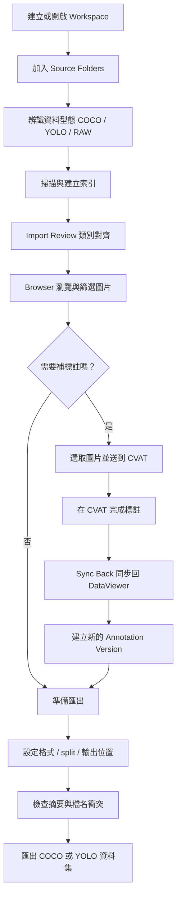

# DataViewer 使用者功能導覽

這份文件是給使用者看的快速導覽，整理 DataViewer 目前的整體目的、主要工作流程，以及 workspace 內各個頁面的用途。

## 1. DataViewer 是在做什麼

DataViewer 是一個桌面工具，主要用來整理本機的電腦視覺資料集，特別是物件偵測流程常見的資料型態：

- `COCO` 資料集
- `YOLO` 資料集
- 尚未標註的 `RAW images`

它的核心目標不是取代標註工具，而是把「多來源資料整理、類別對齊、篩選、送標註、同步回來、重新匯出訓練集」這條工作流程串成一個比較清楚的 workspace。

## 2. 這個工具主要想解決什麼工作

DataViewer 主要想協助這幾類工作：

- 把分散在不同資料夾的資料集整合到同一個 workspace
- 在不修改原始資料的前提下，建立可管理的資料整理流程
- 對齊不同來源的類別名稱，整理成 workspace 層級的 unified categories
- 快速瀏覽圖片、篩選資料、挑選需要補標註的影像
- 把選到的圖片送到 CVAT 做標註
- 將 CVAT 標註結果同步回來，保留成新的 annotation version
- 重新切分 train / valid / test，匯出成可訓練的 `COCO` 或 `YOLO` 資料集

簡單說，DataViewer 比較像是「資料整理與標註流程中控台」，幫你把資料工程與標註協作前後的步驟接起來。

## 3. 工作流程總覽

## 4. 主要頁面功能說明

目前 sidebar 內主要會看到這幾個頁面。

### Workspace Home

用途：

- 建立新的 workspace
- 開啟既有 workspace
- 查看最近使用的 workspace

適合什麼時候用：

- 第一次建立專案時
- 要回到既有 workspace 繼續整理資料時

### Browser

用途：

- 用縮圖牆瀏覽目前 workspace 內的圖片
- 依 source、category、annotation status、檔名等條件篩選
- 選取單張或整批目前篩選結果
- 把選到的圖片送去 CVAT
- 把目前選取範圍帶去 Export

適合什麼時候用：

- 想快速查看資料內容
- 想找出未標註圖片
- 想先篩一批資料再送標註或匯出

### Sources

用途：

- 加入本機 source folder
- 讓系統辨識資料型態並掃描內容
- 查看每個 source 的狀態、圖片數、類別數、掃描時間
- 手動 rescan
- 從 workspace 移除 source

補充：

- DataViewer 的設計原則是不要修改原始資料
- 移除 source 是從 workspace 移除，不是刪除原本資料夾

適合什麼時候用：

- 要把新資料集納入目前 workspace
- 懷疑來源資料夾內容有更新，需要重新掃描時

### Import Review

用途：

- 檢查新匯入 source 的類別
- 決定每個來源類別要：
  - 合併到既有 unified category
  - 建立新類別
  - 忽略不匯入

為什麼重要：

- 不同資料集即使類別名稱很像，也可能語意不同
- 這一步決定後續 Browser、CVAT、Export 看到的類別整理方式

適合什麼時候用：

- 新增資料來源後
- 類別命名不一致，需要人工對齊時

### CVAT Tasks

用途：

- 設定 CVAT 連線資訊
- 從目前選取的圖片建立 CVAT task
- 開啟 CVAT
- 將標註結果同步回 DataViewer

補充：

- DataViewer 會先把選到的圖片整理成 staging task
- 如果 CVAT 連線有設定好，會進一步建立遠端 task 並上傳圖片

適合什麼時候用：

- 準備把一批圖送去標註
- 標註完成後把結果同步回 workspace

### Versions

用途：

- 查看 annotation versions
- 查看 export history

為什麼重要：

- 每次從 CVAT 同步回來，都會保留成新版本，而不是直接覆蓋舊資料
- 匯出紀錄可以幫你追蹤過去輸出的格式、位置與資料量

適合什麼時候用：

- 想確認目前資料版本演進
- 想回顧之前做過哪些匯出

### Export

用途：

- 定義這次匯出的資料範圍
- 選擇輸出格式 `COCO` 或 `YOLO`
- 設定 train / valid / test split ratio
- 設定 random seed
- 指定輸出位置
- 預覽匯出摘要
- 檢查檔名衝突並決定處理方式

補充：

- 匯出時只會使用目前 scope 內可輸出的資料
- 沒有 bbox 的圖片通常會被排除在訓練資料集之外

適合什麼時候用：

- 已經完成篩選與標註整理，準備產出訓練資料集時

## 5. 其他重要頁面

### Image Detail

這個頁面通常不是 sidebar 主入口，但會從 Browser 點進去。

用途：

- 查看單張圖片的大圖
- 查看 bbox overlay
- 查看來源路徑、類別、單張圖的細節資訊

適合什麼時候用：

- 想確認單張圖的標註內容
- 想檢查特定圖片的來源與 metadata

## 6. 一個常見的使用情境

假設你手上有三種資料：

- 一包舊的 `COCO` 標註資料
- 一包 `YOLO` 格式資料
- 一批新的未標註照片

可以這樣使用 DataViewer：

1. 建立一個 workspace
2. 到 `Sources` 把三種來源都加進來
3. 到 `Import Review` 對齊不同來源的類別名稱
4. 到 `Browser` 篩出未標註或想補標註的圖片
5. 把選到的圖片送到 `CVAT Tasks`
6. 在 CVAT 完成標註後同步回來
7. 到 `Versions` 確認新版本有建立
8. 到 `Export` 重新切分並匯出乾淨的訓練資料集

## 7. DataViewer 的幾個設計原則

- 原始來源資料維持 `read-only`
- 類別整併與重要轉換盡量保留人工確認
- 標註同步回來時保留版本，不直接覆蓋
- 匯出時產生獨立資料集，方便後續訓練或交付

## 8. 適合誰使用

DataViewer 比較適合這些角色：

- Dataset engineer
- ML engineer
- 研究人員
- 需要整理本機影像資料與標註流程的人

如果你的工作經常需要處理多份資料集、反覆補標註、重整類別、重新匯出訓練資料，這個工具就是在幫你減少這些流程切換的成本。
